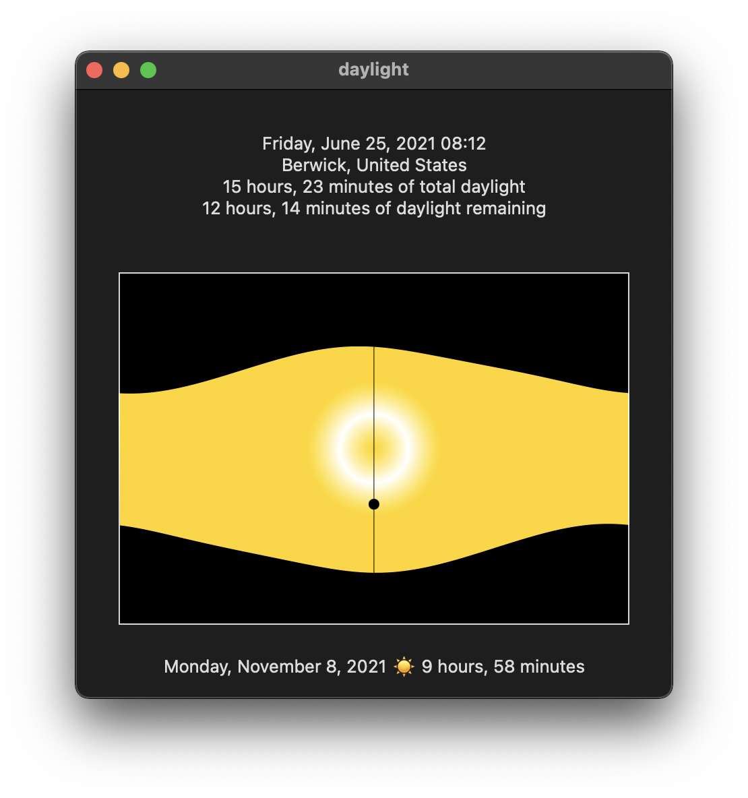

#  daylight

A small WIP iOS/iPadOS/macOS SwiftUI to show the current day's (+ past/future 6mos) daylight hours mostly to experiment with `Shapes` and CoreLocation.

Swap out your Apple Developer team/signing info and build with Xcode (I used 13 beta).

